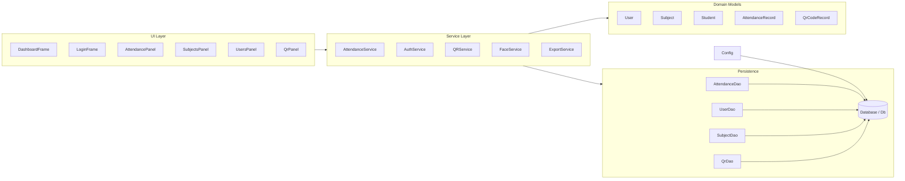
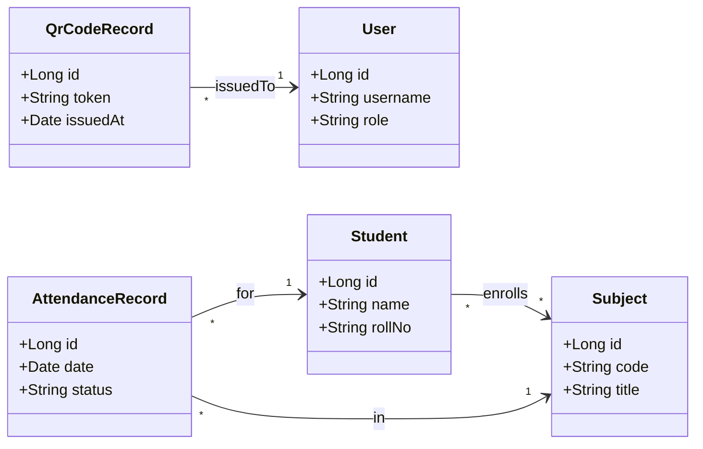
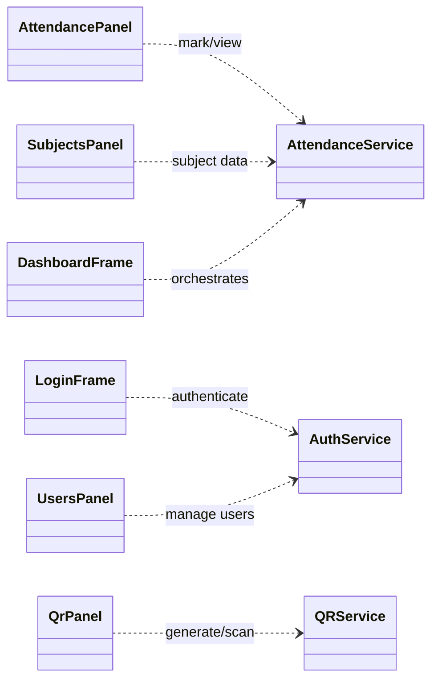

# System Architecture and UML

This document provides a high‑level view of the system using Mermaid diagrams (rendered on GitHub).

## 1) High‑level architecture


## 2) Core domain model (class diagram)


## 3) Services and DAOs (dependencies)
```mermaid
classDiagram
  direction LR
  class AttendanceService {
    +markAttendance(...)
    +getRecords(...)
  }
  class AuthService {
    +login(...)
  }
  class QRService {
    +generateQr(...)
    +scanQr(...)
  }
  class FaceService {
    +detectFace(...)
  }
  class ExportService {
    +exportCsv(...)
  }

  class AttendanceDao
  class UserDao
  class SubjectDao
  class QrDao
  class Database
  class Config

  AttendanceService ..> AttendanceDao : uses
  AttendanceService ..> UserDao : uses
  AttendanceService ..> SubjectDao : uses
  AuthService ..> UserDao : uses
  QRService ..> QrDao : uses
  FaceService ..> "OpenCV (external)" : calls
  ExportService ..> AttendanceDao : reads

  AttendanceDao ..> Database : JDBC
  UserDao ..> Database : JDBC
  SubjectDao ..> Database : JDBC
  QrDao ..> Database : JDBC
  Config ..> Database : configures
```

## 4) UI to Services


Notes:
- Diagrams are simplified and focus on key relationships from the current code structure.
- If you prefer PlantUML instead of Mermaid, I can add equivalent `.puml` files.
